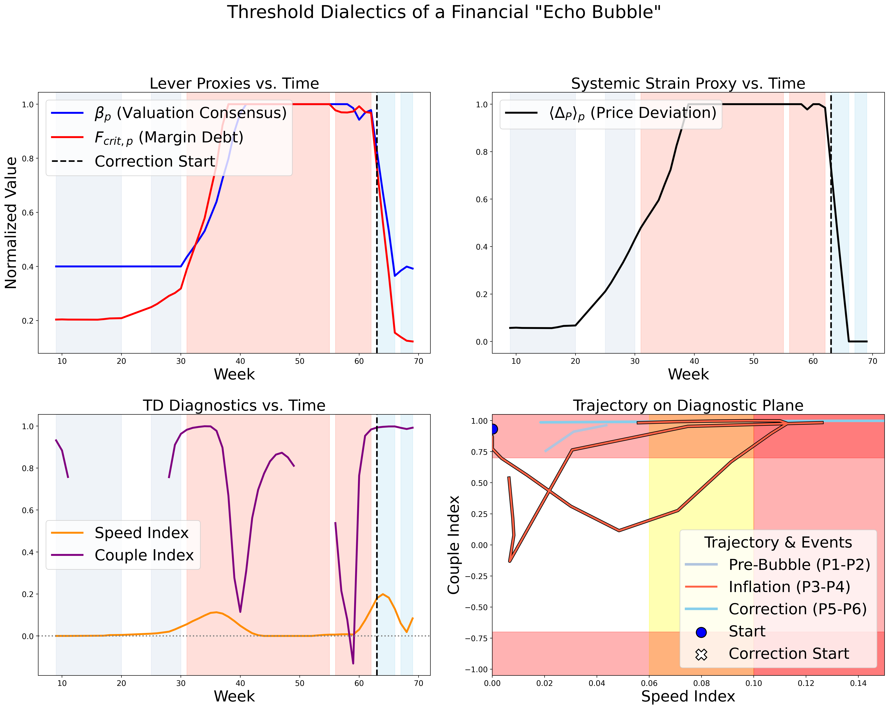
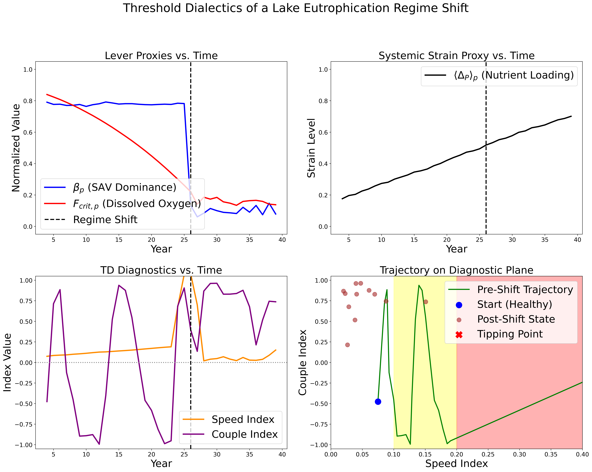

# Chapter 19 Case Study Simulations: Practical Application of Threshold Dialectics

## Overview

This repository contains the complete Python source code for the two data-driven case studies presented in Chapter 19, "Practical Application, Instrumentation, and Case Studies," of the book *Threshold Dialectics: Understanding Complex Systems and Enabling Active Robustness* by Axel Pond.

These simulations are designed to provide tangible, quantitative examples of the Threshold Dialectics (TD) framework in action. They demonstrate how TD diagnostics can reveal the underlying mechanics of fragility in systems with vastly different characteristics and failure modes.

The purpose of this repository is to:
1.  **Provide Full Transparency:** Offer the complete, executable code used to generate the data and figures presented in the book.
2.  **Serve as a Learning Tool:** Allow readers to run, modify, and experiment with both simulations to gain a deeper, hands-on understanding of how different systemic pressures translate into distinct TD signatures.
3.  **Illustrate Framework Versatility:** Showcase how the same core TD principles and diagnostics ("Speed Index", "Couple Index") can be applied to understand a rapid, self-reinforcing financial crisis and a slow-burn ecological regime shift.

## Case Studies Included

This repository contains two distinct simulation scripts:

### 1. The "Echo Bubble" (Financial Market Fragility)

*   **Script:** "echo_bubble_19A.py"
*   **Narrative:** Models the full lifecycle of a speculative financial bubble, from a quiet "Lull" through a frantic "Inflate" phase, to a "Correction" and "Reset."
*   **Key TD Dynamic:** This simulation masterfully illustrates a fragility pathway driven by **strong positive coupling**. Rising valuation consensus ("βp") and increasing margin debt ("Fcrit,p") reinforce each other, a dynamic captured by a "Couple Index" approaching +1.0.

### 2. The "Lake Eutrophication" (Ecological Regime Shift)

*   **Script:** "lake_eutrophication_19B.py.py"
*   **Narrative:** Models the decades-long, slow-burn degradation of a lake ecosystem under chronic nutrient pollution. The system appears stable for years before a sudden, catastrophic "flip" to an algae-dominated state.
*   **Key TD Dynamic:** This simulation highlights the danger of **silent buffer erosion**. The system's state ("βp", SAV Dominance) remains stubbornly resistant to change, while its underlying resilience ("Fcrit,p", Dissolved Oxygen) is steadily depleted. This is captured by a slowly rising "Speed Index" long before the actual collapse.

## Repository Contents

*   "echo_bubble_19A.py": The Python script for the financial market case study.
*   "lake_eutrophication_19B.py.py": The Python script for the ecological regime shift case study.
*   "README.md": This file.
*   "requirements.txt": A single file listing the required Python libraries for both simulations.
*   "financial_bubble_dashboard.png": Example output image from the financial simulation.
*   "lake_eutrophication_dashboard.png": Example output image from the ecological simulation.

## Getting Started

### Prerequisites

You will need Python 3.7 or later. The required libraries are the same for both scripts and are listed in "requirements.txt".

### Installation

1.  **Clone the repository:**
    """bash
    git clone https://github.com/threshold-dialectics/chap19_instrumentation.git
    cd chap19_instrumentation
    """

2.  **Install the required packages:**
    We strongly recommend using a virtual environment to manage dependencies.
    """bash
    python -m venv venv
    source venv/bin/activate  # On Windows, use "venv\Scripts\activate"
    pip install -r requirements.txt
    """

### Running the Simulations

You can run each case study independently from your terminal.

**To run the Financial "Echo Bubble" simulation:**
"""bash
python echo_bubble_19A.py
"""

**To run the Lake Eutrophication simulation:**
"""bash
python lake_eutrophication_19B.py.py
"""

Each script will run its respective simulation, print a status message to the console (e.g., announcing the regime shift), and then display a multi-panel dashboard figure. The figure will also be saved to the repository's root directory.

## Exploring and Comparing the Models

The true value of this repository lies in comparing the two models. Notice how different underlying dynamics produce distinct TD signatures:

*   In "echo_bubble_19A.py", look at the "_update_step" function during the "'P3_Inflate'" phase to see the positive feedback loop that drives the positive "Couple Index".
*   In "lake_eutrophication_19B.py.py", notice in its "_update_step" how "sav_dominance" is modeled to be highly resilient, while "dissolved_oxygen" is steadily depleted. This contrast is what generates the "silent erosion" signature.

By experimenting with the parameters in each script, you can explore the rich landscape of system dynamics that the Threshold Dialectics framework is designed to illuminate.

## Citation

If you use or refer to this code or the concepts from Threshold Dialectics, please cite the accompanying book:

@book{pond2025threshold,
  author    = {Axel Pond},
  title     = {Threshold Dialectics: Understanding Complex Systems and Enabling Active Robustness},
  year      = {2025},
  isbn      = {978-82-693862-2-6},
  publisher = {Amazon Kindle Direct Publishing},
  url       = {https://www.thresholddialectics.com},
  note      = {Code repository: \url{https://github.com/threshold-dialectics}}
}

## License

This project is licensed under the MIT License - see the [LICENSE.md](LICENSE.md) file for details.